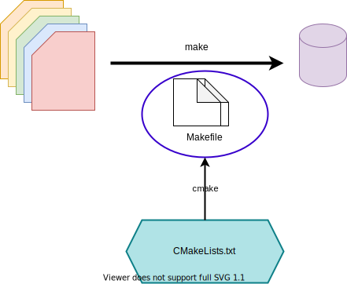

.. _hello-cmake:

From sources to executables
===========================

.. questions::

   - How do we use CMake to compile source files to executables?

.. objectives::

   - Learn what tools available in the CMake suite.
   - Learn how to write a simple ``CMakeLists.txt``.
   - Learn the difference between *build systems*, *build tools*, and *build system generator*.
   - Learn to distinguish between *configuration*, *generation*, and *build* time.

What is CMake?
--------------

Software is everywhere and so are build systems. Whenever you run a piece of
software,  anything from calendar apps to computationally-intensive programs,
there was a build system involved in transforming the plain-text source code
into binary files that could run on the device you are using.

CMake is a **build-system generator**: it provides a family of tools and a
*domain-specific language* (DSL) to **describe** what the build system should
achieve when the appropriate build tools are invoked.
The DSL is platform- *and* compiler-agnostic: you can reuse the same CMake
scripts to obtain *native* build systems on any platform.

   On GNU/Linux, the native build system will be a collection of ``Makefile``-s.
   The ``make`` build tool uses these ``Makefile``-s to transform sources to
   executables and libraries.
   CMake abstracts the process of generating the ``Makefile``-s away into a
   generic DSL.

Hello, CMake!
-------------

.. typealong:: Compiling "Hello, world" with CMake

   We will now proceed to compile a single source file to an executable. Choose
   your favorite language and start typing along!

   .. tabs::

      .. tab:: C++

         Download  :download:`scaffold project <code/tarballs/00_hello-cxx.tar.bz2>`.

         .. literalinclude:: code/day-1/00_hello-cxx/hello.cpp
            :language: c++

         You can download the :download:`complete, working example <code/tarballs/00_hello-cxx_solution.tar.bz2>`.

         Then unpack the archive::

           tar xf hello-cxx_solution.tar.bz2

      .. tab:: Fortran

         Download the :download:`scaffold project <code/tarballs/00_hello-f.tar.bz2>`.

         .. literalinclude:: code/day-1/00_hello-f/hello.f90
            :language: fortran

         You can download the :download:`complete, working example <code/tarballs/00_hello-f_solution.tar.bz2>`.

         Then unpack the archive::

           tar xf hello-f_solution.tar.bz2

   1. The folder contains only the source code. We need to add a file called
      ``CMakeLists.txt`` to it.  CMake reads the contents of these special files
      when generating the build system.

   2. The first thing we will do is declare the requirement on minimum version of CMake:

      .. code-block:: cmake

         cmake_minimum_required(VERSION 3.13)

   3. Next, we declare our project and its programming language:

      .. code-block:: cmake

         project(Hello LANGUAGES CXX)

   4. We create an *executable target*. CMake will generate rules in the build
      system to compile and link our source file into an executable:

      .. code-block:: cmake

         add_executable(hello hello.cpp)

   5. We are ready to call CMake and get our build system:

      .. code-block:: bash

         $ cmake -S. -Bbuild

   6. And finally build our executable:

      .. code-block:: bash

         $ cmake --build build

There are few things to note here:

1. Any CMake build system will invoke the following commands in its **root**
   ``CMakeLists.txt``:

   .. signature:: |cmake_minimum_required|

      .. code-block:: cmake

         cmake_minimum_required(VERSION <min>[...<max>] [FATAL_ERROR])

   .. parameters::

      ``VERSION``
          Minimum and, optionally, maximum version of CMake to use.
      ``FATAL_ERROR``
          Raise a fatal error if the version constraint is not satisfied. This
          option is ignored by CMake >=2.6

   .. signature:: |project|

      .. code-block:: cmake

         project(<PROJECT-NAME>
                 [VERSION <major>[.<minor>[.<patch>[.<tweak>]]]]
                 [DESCRIPTION <project-description-string>]
                 [HOMEPAGE_URL <url-string>]
                 [LANGUAGES <language-name>...])

   .. parameters::

      ``<PROJECT-NAME>``
          The name of the project.
      ``LANGUAGES``
          Languages in the project.

2. The case of CMake commands and variables does not matter: the DSL is
   case-insensitive. However, the plain-text files that CMake parses **must be
   called** ``CMakeLists.txt`` and the case matters!
3. The command to add executables to the build system is, unsurprisingly, |add_executable|:

   .. signature:: |add_executable|

      .. code-block:: cmake

         add_executable(<name> [WIN32] [MACOSX_BUNDLE]
                        [EXCLUDE_FROM_ALL]
                        [source1] [source2 ...])

4. Using CMake you can abstract the generation of the build system and also the
   invocation of the build tools.

.. typealong:: The command-line interface to CMake

   Let us get acquainted with the CMake and especially its command-line interface.

   We can get help at any time with:

   .. code-block:: bash

      $ cmake --help

   This will output quite a number of options to your screen.
   We can analyze the last few lines first:

   .. code-block:: text

      Generators

      The following generators are available on this platform (* marks default):
      * Unix Makefiles               = Generates standard UNIX makefiles.
        Green Hills MULTI            = Generates Green Hills MULTI files
                                       (experimental, work-in-progress).
        Ninja                        = Generates build.ninja files.
        Ninja Multi-Config           = Generates build-<Config>.ninja files.
        Watcom WMake                 = Generates Watcom WMake makefiles.
        CodeBlocks - Ninja           = Generates CodeBlocks project files.
        CodeBlocks - Unix Makefiles  = Generates CodeBlocks project files.
        CodeLite - Ninja             = Generates CodeLite project files.
        CodeLite - Unix Makefiles    = Generates CodeLite project files.
        Sublime Text 2 - Ninja       = Generates Sublime Text 2 project files.
        Sublime Text 2 - Unix Makefiles
                                     = Generates Sublime Text 2 project files.
        Kate - Ninja                 = Generates Kate project files.
        Kate - Unix Makefiles        = Generates Kate project files.
        Eclipse CDT4 - Ninja         = Generates Eclipse CDT 4.0 project files.
        Eclipse CDT4 - Unix Makefiles= Generates Eclipse CDT 4.0 project files.

   In CMake terminology, the native build scripts and build tools are called
   **generators**. On any particular platform, the list will show which native
   build tools can be used through CMake. They can either be "plain", such as
   ``Makefile``-s or Ninja, or IDE-like projects.

   The ``-S`` switch specifies which source directory CMake should scan: this is
   the folder containing the *root* ``CMakeLists.txt``, *i.e.* the one containing
   the |project| command.
   By default, CMake will allow *in-source* builds, *i.e.* storing build
   artifacts alongside source files. This is **not** good practice: you should
   always keep build artifacts from sources separate. Fortunately, the ``-B``
   switch helps with that, as it is used to give where to store build artifacts,
   including the generated build system. This is the minimal invocation of ``cmake``:

   .. code-block:: bash

      $ cmake -S. -Bbuild

   To switch to another generator, we will use the ``-G`` switch:

   .. code-block:: bash

      $ cmake -S. -Bbuild -GNinja

   Options to be used at build-system generation are passed with the ``-D``
   switch. For example, to change compilers:

   .. code-block:: bash

      $ cmake -S. -Bbuild -GNinja -DCMAKE_CXX_COMPILER=clang++

   Finally, you can access the full CMake manual with:

   .. code-block:: bash

      $ cmake --help-full

   You can also inquire about a specific module, command or variable:

   .. code-block:: bash

      $ cmake --help-variable CMAKE_GENERATOR

A complete toolchain
--------------------

The family of tools provided with CMake offers a complete toolchain to manage
the development cycle: from sources to build artifacts, testing, and deployment.
We refer to these stages as *CMake times* and each tool is appropriate at a specific time. In this workshop, we will discuss:

- **CMake time** or **configure time**. This is the stage when ``cmake`` is
  invoked to parse the ``CMakeLists.txt`` in your project, configure and generate the build
  system.
- **Build time**. This is handled by the native build tools, but, as we have
  seen, these can be effectively wrapped by ``cmake`` itself.
- **CTest time** or **test time**. At this stage, you will test your build
  artifacts.

.. figure:: img/cmake-times.jpg
   :align: center

   You can manage all the stages of a software project's lifetime with the tools provided by CMake.
   This figure shows all these stages (*times*) and which tool is appropriate for each.
   The figure is reproduced from `CMake Cookbook
   <https://github.com/dev-cafe/cmake-cookbook>`_ and is licensed under the
   terms of the `CC-BY-SA
   <https://creativecommons.org/licenses/by-sa/4.0/legalcode>`_.

Producing libraries
-------------------

CMake can of course be used to produce libraries as well as executables.
The relevant command is |add_library|:

.. signature:: |add_library|

   .. code-block:: cmake

      add_library(<name> [STATIC | SHARED | MODULE]
                  [EXCLUDE_FROM_ALL]
                  [<source>...])

You can link libraries into executables with |target_link_libraries|:

.. signature:: |target_link_libraries|

   .. code-block:: cmake

      target_link_libraries(<target>
                            <PRIVATE|PUBLIC|INTERFACE> <item>...
                           [<PRIVATE|PUBLIC|INTERFACE> <item>...]...)

.. callout:: Executables and libraries are targets

   We will encounter the term **target** repeatedly. In CMake, a target is any
   object given as first argument to |add_executable| or |add_library|.  Targets
   are the basic atom in CMake.  Whenever you will need to organize complex
   projects, think in terms of its targets and their mutual dependencies.  The
   whole family of CMake commands ``target_*`` can be used to express chains of
   dependencies and is much more effective than keeping track of state with
   variables.  We will clarify these concepts in :ref:`targets`.

.. challenge:: Producing libraries

   .. tabs::

      .. tab:: C++

         Download the :download:`scaffold project <code/tarballs/01_libraries-cxx.tar.bz2>`.

         #. Write a ``CMakeLists.txt`` to compile the source files
            ``Message.hpp`` and  ``Message.cpp`` into a library. Do not specify
            the type of library, shared or static, explicitly.
         #. Add an executable from the ``hello-world.cpp`` source file.
         #. Link the library into the executable.

         You can download the :download:`complete, working example <code/tarballs/01_libraries-cxx_solution.tar.bz2>`.

      .. tab:: Fortran

         Download the :download:`scaffold project <code/tarballs/01_libraries-f.tar.bz2>`.

         #. Write a ``CMakeLists.txt`` to compile the source files
            ``message.f90`` into a library. Do not specify the type of library,
            shared or static, explicitly.
         #. Add an executable from the ``hello-world.f90`` source file.
         #. Link the library into the executable.

         You can download the :download:`complete, working example <code/tarballs/01_libraries-f_solution.tar.bz2>`.

   What kind of library did you get? Static or shared? Try configuring the project as follows:

   .. code-block:: bash

      $ cmake -S. -Bbuild -GNinja -DBUILD_SHARED_LIBS=ON

   The ``BUILD_SHARED_LIBS`` variable influences the default behavior of |add_library|.

.. keypoints::

   - CMake is a **build system generator**, not a build system.
   - You write ``CMakeLists.txt`` to describe how the build tools will create artifacts from sources.
   - You can use the CMake suite of tools to manage the whole lifetime: from source files to tests to deployment.
   - The structure of the project is mirrored in the build folder.
