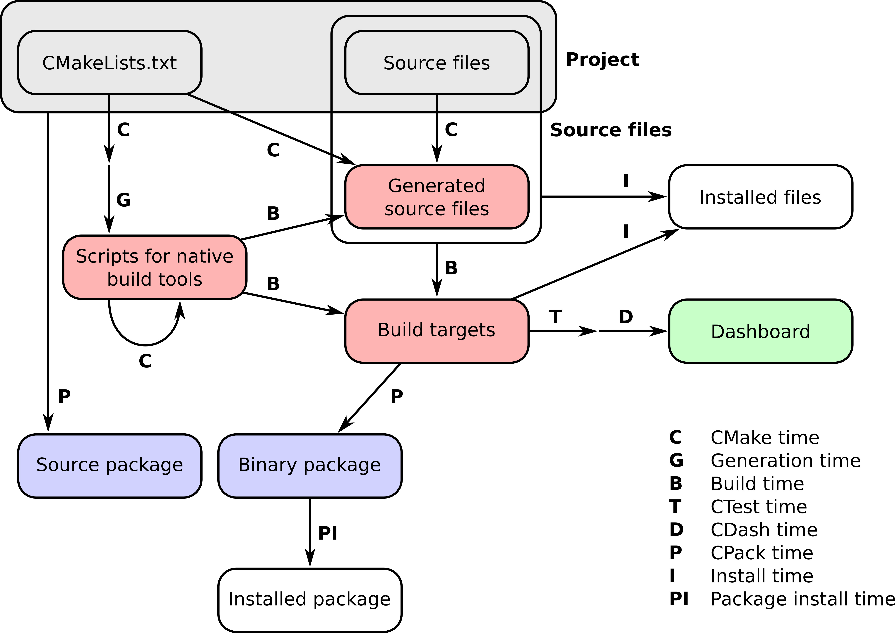

.. _hello-cmake:

From sources to executables
===========================

.. questions::

   - How do we use CMake to compile source files to executables?

.. objectives::

   - Learn what tools available in the CMake suite.
   - Learn how to write a simple ``CMakeLists.txt``.
   - Learn the difference between *build systems*, *build tools*, and *build system generator*.
   - Learn to distinguish between *configuration*, *generation*, and *build* time.

What is CMake?
--------------

.. todo::

   - CMake is a build system generator: difference with ``Makefile`` or project files.

Hello, CMake!
-------------

.. todo::

   - Introduce ``cmake_minimum_required``
   - Introduce ``project``
   - Introduce ``add_executable``

.. typealong:: Compiling "Hello, world" with CMake

   We will now proceed to compile a single source file to an executable. Choose
   your favorite language and start typing along!

   .. tabs::

      .. tab:: C++

         Download the :download:`scaffold project <code/tarballs/hello-cxx.tar.bz2>`.

         .. literalinclude:: code/hello-cxx/hello.cpp
            :language: c++

         You can download the :download:`complete, working example <code/tarballs/hello-cxx_solution.tar.bz2>`.

      .. tab:: Fortran

         Download the :download:`scaffold project <code/tarballs/hello-f.tar.bz2>`.

         .. literalinclude:: code/hello-f/hello.f90
            :language: fortran

         You can download the :download:`complete, working example <code/tarballs/hello-f_solution.tar.bz2>`.

   1. We will unpack the tarball with the scaffold project:

      .. code-block:: bash

         tar xjf hello-cxx.tar.bz2
   2.

Any CMake build system will invoke the following commands in its **root** ``CMakeLists.txt``:

.. signature:: |cmake_minimum_required|

   .. code-block:: cmake

      cmake_minimum_required(VERSION <min>[...<max>] [FATAL_ERROR])

.. parameters::

   ``VERSION``
       Minimum and, optionally, maximum version of CMake to use.
   ``FATAL_ERROR``
       Raise a fatal error if the version constraint is not satisfied. This
       option is ignored by CMake >=2.6

.. signature:: |project|

   .. code-block:: cmake

      project(<PROJECT-NAME>
              [VERSION <major>[.<minor>[.<patch>[.<tweak>]]]]
              [DESCRIPTION <project-description-string>]
              [HOMEPAGE_URL <url-string>]
              [LANGUAGES <language-name>...])

.. parameters::

   ``<PROJECT-NAME>``
       The name of the project.
   ``LANGUAGES``
       Languages in the project.

The command-line interface to CMake
-----------------------------------

.. todo::

   How to interact with  CMake on the command line:

     - Switching generators ``-G`` switch
     - How to get help
     - Switching compilers

A complete toolchain
--------------------

   You can manage all the stages of a software project's lifetime with the tools provided by CMake.
   This figure shows all these stages (*times*) and which tool is appropriate for each.
   The figure is reproduced from `**CMake Cookbook**
   <https://github.com/dev-cafe/cmake-cookbook>`_ and is licensed under the
   terms of the `CC-BY-SA
   <https://creativecommons.org/licenses/by-sa/4.0/legalcode>`_.

Producing libraries
-------------------

.. todo::

   - Produce a library
   - Switch the type of library with ``BUILD_SHARED_LIBS``
   - Introduce ``message``
   - Introduce ``CMakePrintHelpers`` and ``cmake_print_variables``

.. challenge:: Producing libraries

   .. tabs::

      .. tab:: C++

         Download the :download:`scaffold project <code/tarballs/libraries-cxx.tar.bz2>`.

         Write a ``CMakeLists.txt`` to compile the source files ``Message.hpp``
         and  ``Message.cpp`` into a library and then link it into the
         executable resulting from the ``hello-world.cpp`` source file.

         You can download the :download:`complete, working example <code/tarballs/libraries-cxx_solution.tar.bz2>`.

      .. tab:: Fortran

         Download the :download:`scaffold project <code/tarballs/libraries-f.tar.bz2>`.

         Write a ``CMakeLists.txt`` to compile the source file ``message.f90``
         into a library and then link it into the
         executable resulting from the ``hello-world.f90`` source file.

         You can download the :download:`complete, working example <code/tarballs/libraries-f_solution.tar.bz2>`.

.. keypoints::

   - CMake is a **build system generator**, not a build system.
   - You write ``CMakeLists.txt`` to describe how the build tools will create artifacts from sources.
   - You can use the CMake suite of tools to manage the whole lifetime: from source files to tests to deployment.
   - The structure of the project is mirrored in the build folder.
