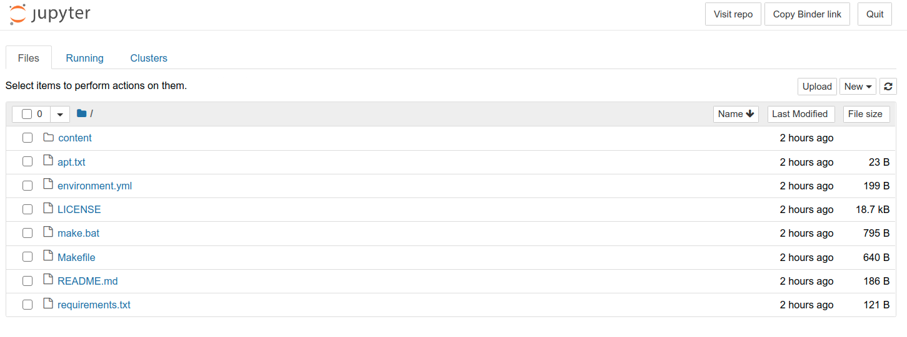
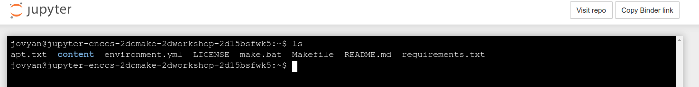

Setting up your system
======================

In order to follow this workshop, you will need access to compilers,
Python and CMake. You can use an HPC cluster if you have access to
one, but the instructions here cover how to install the prerequisites
on your own computer. We also show how you can use `Binder
<https://mybinder.org>`_ to run in the cloud.

These instructions are based on installing compilers and CMake via the `Conda
package and enviroment manager <https://docs.conda.io/en/latest/>`_, as it
provides a convenient way to install binary packages in an isolated software
environment.

For Windows users
^^^^^^^^^^^^^^^^^

We strongly recommend to use (and install if necessary) the Windows
Subsystem for Linux (WSL) as it is a powerful tool which will likely
be useful also after the workshop.  Inside WSL you will need Python 3
and the conda environment manager.  A useful guide to doing
this is found at https://github.com/kapsakcj/win10-linux-conda-how-to.
The installation of the required dependencies in a WSL terminal is
documented below.

For MacOS and Linux users
^^^^^^^^^^^^^^^^^^^^^^^^^

MacOS and Linux users can simply open a terminal and install 
`Miniconda <https://docs.conda.io/en/latest/miniconda.html>`_:
  
- For MacOS see https://docs.conda.io/en/latest/miniconda.html#macosx-installers
- For Linux see https://docs.conda.io/en/latest/miniconda.html#linux-installers

Creating an environment and installing packages
^^^^^^^^^^^^^^^^^^^^^^^^^^^^^^^^^^^^^^^^^^^^^^^

Once you have ``conda`` installed (and WSL if you're on Windows) you
can use the :download:`environment.yml <../environment.yml>` file to
install the dependencies.  First save it to your hard drive by
clicking the link, and then in a terminal navigate to where you saved
the file and type::

  conda env create -f environment.yml

You then need to activate the new environment by::

  conda activate cmake-workshop

Now you should have CMake, compilers, Python and a few other packages
installed!

Using Binder
^^^^^^^^^^^^

`MyBinder <https://mybinder.org/>`_ offers a free customizable cloud
computing environment. You can do the CMake workshop exercises in the
cloud by clicking the "launch binder" button at the top of the README
file displayed at https://github.com/ENCCS/cmake-workshop.

.. figure:: img/launch_binder_button.png
   :scale: 70%
   :alt: Launching the binder
   :align: center

This will bring you to the loading page for the binder notebook, which might
take a few minutes to start up. Don't despair!

.. figure:: img/binder_loading.png
   :scale: 50%
   :alt: The binder is loading
   :align: center

Once loaded, you will see a Jupyter Notebook dashboard which is running in the
cloud.

To open up a terminal, click "New" on the right and select Terminal.

.. figure:: img/open_terminal_in_binder.png
   :scale: 50%
   :alt: The notebook dashboard
   :align: center

You can browse the whole content of the workshop with ``ls content``. The code
exercises are in ``content/code``.

You can open a text editor (for code, CMake files etc) by clicking "New" and
select Text File. If you prefer a terminal editor, you can use ``nano`` or
``vim`` or ``emacs``.
