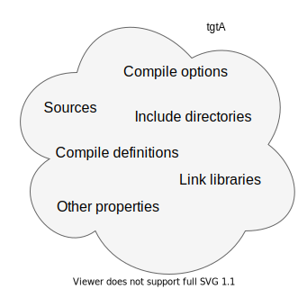

.. _targets:

Target-based build systems with CMake
=====================================

.. questions::

   - How can we handle more complex projects with CMake?
   - What exactly are **targets** in the CMake domain-specific language (DSL)?

.. objectives::

   - Learn that the basic elements in CMake are *not* variables, *but* targets.
   - Learn how to work with projects spanning multiple folders.
   - Learn how to handle multiple targets in one project.

It's all about the targets
--------------------------

   A target is the basic element in the CMake DSL. Each target has *properties*,
   which can be read with |get_target_property| and modified with
   |set_target_properties|.  Compile options, definitions, include directories,
   source files, link libraries, and link options are properties of targets.

It is much more robust to use targets and properties than using variables.
Given a target ``tgtA``, we can invoke one command in the ``target_*`` family as:

.. code-block:: cmake

   target_link_libraries(tgtA
     PRIVATE tgtB
     INTERFACE tgtC
     PUBLIC tgtD
     )

the use of the visibility levels will achieve the following:

- ``PRIVATE``. The property will only be used to build the target given as first
  argument.  In our pseudo-code, ``tgtB`` will only be used to build ``tgtA``
  but not be propagated as a dependency to other targets consuming ``tgtA``.
- ``INTERFACE``. The property will only be used to build targets that consume
  the target given as first argument.  In our pseudo-code, ``tgtC`` will only be
  propagated as a dependency to other targets consuming ``tgtA``.
- ``PUBLIC``. The property will be used **both** to build the target given as
  first argument **and** targets that consume it.  In our pseudo-code, ``tgtD``
  will be used to build ``tgtA`` and will be propagated as a dependency to
  any other targets consuming ``tgtA``.

.. figure:: img/target_inheritance.svg
   :align: center

   Properties on targets have **visibility levels**, which determine how CMake
   should propagate them between interdependent targets.

The five most used commands used to handle targets are:

.. signature:: |target_sources|

   .. code-block:: cmake

      target_sources(<target>
        <INTERFACE|PUBLIC|PRIVATE> [items1...]
        [<INTERFACE|PUBLIC|PRIVATE> [items2...] ...])

   Use it to specify which source files to use when compiling a target.

.. signature:: |target_compile_options|

   .. code-block:: cmake

      target_compile_options(<target> [BEFORE]
        <INTERFACE|PUBLIC|PRIVATE> [items1...]
        [<INTERFACE|PUBLIC|PRIVATE> [items2...] ...])

   Use it to specify which compiler flags to use.

.. signature:: |target_compile_definitions|

   .. code-block:: cmake

      target_compile_definitions(<target>
        <INTERFACE|PUBLIC|PRIVATE> [items1...]
        [<INTERFACE|PUBLIC|PRIVATE> [items2...] ...])

   Use it to specify which compiler definitions to use.

.. signature:: |target_include_directories|

   .. code-block:: cmake

      target_include_directories(<target> [SYSTEM] [BEFORE]
        <INTERFACE|PUBLIC|PRIVATE> [items1...]
        [<INTERFACE|PUBLIC|PRIVATE> [items2...] ...])

   Use it to specify which directories will contain header (for C/C++) and
   module (for Fortran) files.

.. signature:: |target_link_libraries|

   .. code-block:: cmake

      target_link_libraries(<target>
        <PRIVATE|PUBLIC|INTERFACE> <item>...
        [<PRIVATE|PUBLIC|INTERFACE> <item>...]...)

   Use it to specify which libraries to link into the current target.

There are additional commands in the ``target_*`` family:

.. code-block:: bash

   $ cmake --help-command-link | grep "^target_"

Multiple folders
----------------

.. challenge:: A C++ project with multiple targets

   You can download the :download:`scaffold code <code/tarballs/multiple-cxx.tar.bz2>` and
   the :download:`complete working example <code/tarballs/multiple-cxx_solution.tar.bz2>`.

Organizing Fortran projects
---------------------------

.. challenge:: A Fortran project with multiple targets

   You can download the :download:`scaffold code <code/tarballs/multiple-f.tar.bz2>` and
   the :download:`complete working example <code/tarballs/multiple-f_solution.tar.bz2>`.

.. keypoints::

   - Using targets, you can achieve granular control over how artifacts are
     built and how their dependencies are handled.
   - Compiler flags, definitions, source files, include folders, link libraries,
     and linker options are **properties** of a target.
   - Never use variables to express dependencies between targets: use the
     visibility levels ``PRIVATE``, ``INTERFACE``, ``PUBLIC`` and let CMake
     figure out the details.
   - Usee |get_property| to inquire and |set_property| to modify values of
     properties.
